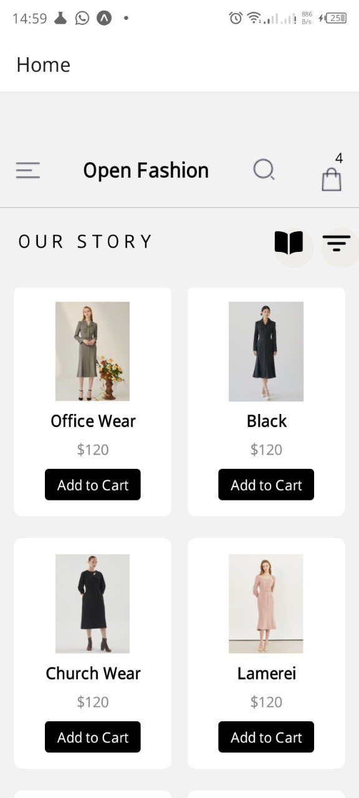

# rn-assignment6-11210750
# Project Overview
This React Native project is an e-commerce application named "Open Fashion." The app displays a list of fashion products and allows users to add products to a cart and view the cart's contents.

# Features
Home Screen: Displays a list of products with options to add them to the cart.
Cart Screen: Displays the items added to the cart, with the ability to remove items.
Persistent Storage: Cart items are stored locally using AsyncStorage, ensuring data persistence across app restarts.

# Design Choices
1. Component-Based Structure
HomeScreen: Handles the display of products and interactions with the cart.
CartScreen: Manages the display of cart items and allows removal of items.
ProductItem: Represents individual product items, making the code modular and reusable.
2. Persistent Storage with AsyncStorage
AsyncStorage is used to persist cart data locally on the device. This ensures that the cart contents are maintained even when the app is closed and reopened.
State Management: The useState and useEffect hooks manage the state of the cart items and load the stored cart data when the app initializes.

# Implementation Details
Data Storage
Loading Data: On app startup, the cart data is loaded from AsyncStorage and set in the component state using the useEffect hook.
Updating Data: When a product is added to or removed from the cart, the new cart state is saved to AsyncStorage, ensuring persistent storage.

# File Structure
App.js: Sets up the navigation between HomeScreen and CartScreen.
screens/HomeScreen.js: Displays products and handles adding items to the cart.
screens/CartScreen.js: Displays the contents of the cart and handles removal of items.
components/ProductItem.js: Renders individual product items.
## Screenshots

### Home Screen

### Cart Screen

# Getting Started
Clone the repository

bash
Copy code
git clone https://github.com/your-repository.git
cd your-repository
Install dependencies

bash
Copy code
npm install
Run the app

bash
Copy code
npm start
Dependencies
React Native: Core library for building the app.
@react-navigation/native: Navigation library for managing app screens.
@react-navigation/stack: Stack navigator for navigation.
@react-native-async-storage/async-storage: For persistent storage.
@expo/vector-icons: Icons used in the app.#